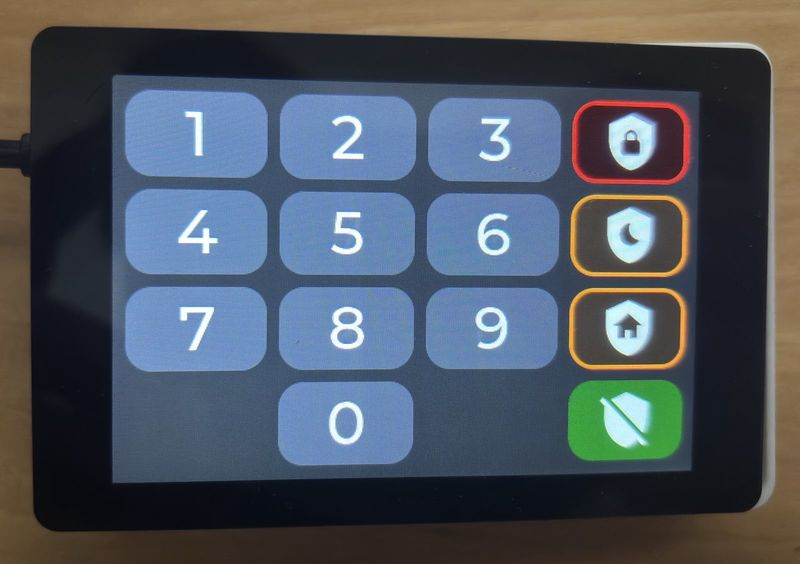
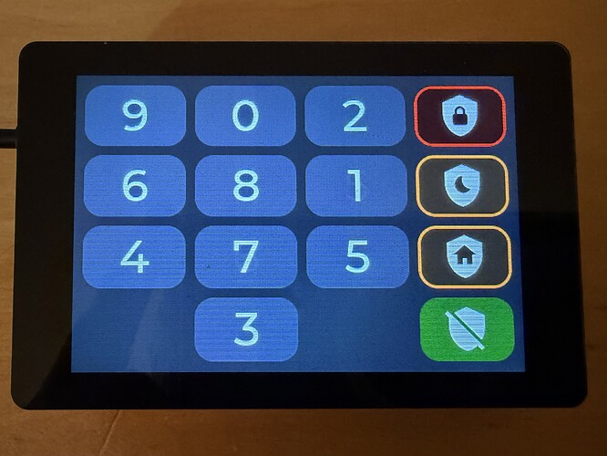

# Alarmo-Keypad
WT32-SC01 Plus Alarmo keypad for use in Home Assistant with some special sauce

  <figure style="display:inline-block; text-align:center; margin:0 10px;">
    
    <figcaption><em>Standard keypad layout</em></figcaption>
  </figure>

  <figure style="display:inline-block; text-align:center; margin:0 10px;">
    
    <figcaption><em>Chameleon (scrambled) keypad</em></figcaption>
  </figure>

Since there was no nice readily available keypad for the Alarmo integration in Home Assistant we decided to create our own

- Uses WT32-SC01 Plus display with integrated ESP32S3 [Buy on AliExpress](https://a.aliexpress.com/_ExfMKwG)
- Supports Arm-Away / Arm-Night / Arm-Home _(full Alarmo support these are just pre configured)_
- With chameleon function to scramble the keypad every time it is used
- Works great with the [Konnected alarm panel](https://konnected.io/) to build your own Home Alarm
- Speakers used 20mm version [Buy on AliExpress](https://a.aliexpress.com/_EGAeVFw)
- A 3D file for a wall mounted housing is also available

Install:
- create a new device in ESPHOME for your WT32-SC01 Plus
- copy the [alarm-panel.yaml](./alarm-panel.yaml) file in your newly created device but keep your unique api: encryption key
- copy the [WAV files](./Audio/)  to the esphome folder
- hit install in ESPHOME
- If needed tweak the settings in the substitutions section to suit your needs
